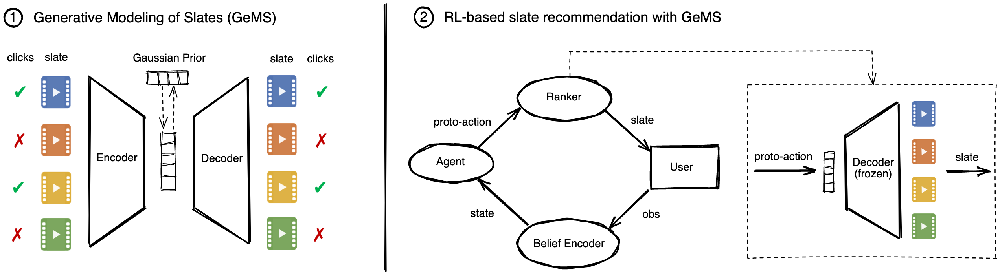

**Generative Slate Recommendation with Reinforcement Learning**
======

## __Introduction__

This repository provides the source code for *Generative Slate Recommendation with Reinforcement Learning* by Romain Deffayet, Thibaut Thonet, Jean-Michel Renders, and Maarten de Rijke. The implementation is based on Python 3.9 and PyTorch. More details about this work can be found in the [original paper](https://dl.acm.org/doi/10.1145/3539597.3570412).

**Abstract:** Recommender systems are traditionally designed and trained to maximize immediate user engagement. However, this leads to common pitfalls such as user boredom and filter bubbles. This traditional limitation is increasingly inspiring research into optimization of long-term user engagement. Reinforcement learning (RL) algorithms capture the sequential and interactive nature of recommendation, and thus offer a principled way to deal with long-term rewards and avoid myopic behaviors. However, RL approaches become intractable in the Slate Recommendation scenario – where a list of items is recommended at each interaction turn – due to the combinatorial action space. Indeed, in that setting, an action corresponds to a slate that may contain any combination of items.
While previous work has proposed well-chosen decompositions of actions so as to ensure tractability, these typically rely on restrictive and sometimes unrealistic assumptions. In this work, we propose instead to encode slates in a continuous, low-dimensional latent space learned by a variational auto-encoder. Then, the RL agent chooses continuous actions from this latent space, which are ultimately decoded into the corresponding slates. By doing so, we are able to (1) relax assumptions required by previous work, and (2) improve the quality of the action selection by modeling full slates instead of independent items, in particular by enabling diversity. Our experiments performed on a wide array of simulated environments confirm the effectiveness of our generative modeling of slates (GeMS) over baselines in practical scenarios where the restrictive assumptions underlying the baselines are lifted. Our findings suggest that representation learning using generative models is a promising direction towards generalizable RL-based slate recommender systems.

<p align="center">

</p>

If you find this code useful, please consider citing us:

Deffayet, R., Thonet, T., Renders, J.-M., & De Rijke, M. (2022). **Generative Slate Recommendation with Reinforcement Learning**.
```
@inproceedings{GeMS,
	author = {Deffayet, Romain and Thonet, Thibaut and Renders, Jean-Michel and de Rijke, Maarten},
	title = {Generative Slate Recommendation with Reinforcement Learning},
	year = {2023},
	isbn = {9781450394079},
	publisher = {Association for Computing Machinery},
	address = {New York, NY, USA},
	url = {https://doi.org/10.1145/3539597.3570412},
	doi = {10.1145/3539597.3570412},
	booktitle = {Proceedings of the Sixteenth ACM International Conference on Web Search and Data Mining},
	pages = {580–588},
	numpages = {9},
	keywords = {slate recommendation, reinforcement learning, variational auto-encoder},
	location = {Singapore, Singapore},
	series = {WSDM '23}
}
```

## __Content of the repository__

The repository contains the following directories and files:

* The directory **GeMS/** contains the code for pre-training the GeMS variational autoencoder on logged data. It also contains the code for training a matrix factorization, which is used for baselines that require pre-trained embeddings.
* The directory **RecSim/** defines the recommendation simulators used as RL environment. It also includes the code for generating the logged data used to train GeMS.
* The directory **config/** contains the yml files which define the hyperparameters to train the different RL agents (SAC+GeMS and the baselines).
* The directory **data/** includes the item embeddings generated for the RecSim environment and the pre-trained Matrix Factorization embeddings for the different environments used in the paper. It is also used to store the generated logged data and model checkpoints.
* The directory **modules/** contains the code for the RL agent and belief encoder.
* The file **README.md** is the current file.
* The file **combine_results.py** gathers the results of several runs and performs statistical significance testing.
* The file **plot_tradeoffs.py** reproduces the results from Figure 3 in the paper.
* The file **requirements.txt** indicates the Python libraries required to run the code.
* The file **train_agent.py** is the entry point to train the RL agent. After training, the checkpoint with the highest validation return is selected and the corresponding RL agent is tested on the environment.

## __Required libraries__

The libraries required to run this code are indicated in the ``requirements.txt`` file. Using pip, the libraries can be simply installed using the following command:

	pip install -r requirements.txt

## __Generating the logged data__

GeMS requires a log dataset for training before it can be used within an RL framework. The generation of the logged data is done by running the script ``RecSim/generate_dataset.py``. The required arguments are specified in ``RecSim/config/generate_datasets.yml`` for the 6 environments considered in the paper (TopDown-focused, TopDown-diffuse, Mixed-focused, Mixed-diffuse, DivPen-focused, and DivPen-diffuse). For example, to generate the logged data for the TopDown-focused environment, one can run the following command:

	python RecSim/generate_dataset.py --n_sess=100000 --epsilon_pol=0.5 --env_name="TopicRec" --num_items=1000 --boredom_threshold=5 --recent_items_maxlen=10 --boredom_moving_window=5 --short_term_boost=1.0 --episode_length=100 --topic_size=2 --num_topics=10 --env_offset=0.28 --env_slope=100 --env_omega=0.9 --env_embedds="item_embeddings_focused.pt" --click_model="tdPBM" --path="data/RecSim/datasets/focused_topdown"
	
This will generate a dataset as a .pt file in ``data/RecSim/datasets/``.
	
## __Pre-training GeMS__

Once the logged data is generated, the GeMS variational auto-encoder is trained by running the script ``GeMS/pretrain_ranker.py``. The required arguments are specified in ``GeMS/config/pretrain_GeMS.yml``. For example, to pre-train GeMS for seed 58407201 on the TopDown-focused environment, one can run the following command:

	python GeMS/pretrain_ranker.py --ranker="GeMS" --max_epochs=10 --dataset="data/RecSim/datasets/focused_topdown_moving_env.pt" --seed=58407201 --item_embedds="scratch" --lambda_click=0.2 --lambda_KL=0.5 --lambda_prior=0.0 --latent_dim=32 --device="cuda" --batch_size=256 --ranker_lr=0.001
	
This will generate a model checkpoint for GeMS (.pt file) in ``data/GSM/checkpoints/``.
	
## __Running Matrix Factorization__

The TopK and WkNN baselines require access to pre-trained item embeddings. To obtain these, we run a Matrix Factorization on the logged data. This can be done by running the script ``GeMS/train_MF.py``. The required arguments are specified in ``GeMS/config/pretrain_MF.yml``. For example, to train matrix factorization embeddings from the logged data of the TopDown-focused environment, one can run the following command:

	python GeMS/train_MF.py --MF_dataset="focused_topdown_moving_env.pt"
	
This will generate a model checkpoint (.pt file) containing MF embeddings in ``data/MF_embeddings/``.
	
## __Training and testing RL agents__

Training the RL agent SAC+GeMS is done by running the script ``train_agent.py``. The required arguments are specified in ``config/train_SAC+GeMS.yml``. For example, to train a SAC+GeMS agent for seed 58407201 on the TopDown-focused environment, one can run the following command:

	python train_agent.py --agent="SAC" --beliefs actor critic --item_embedds="scratch" --env_name="topics" --device="cuda" --max_steps=100000 --check_val_every_n_epoch=1000 --val_step_length=200 --test_size=500 --latent_dim=32 --ranker="GeMS" --belief="GRU" --name="SAC+GeMS" --lambda_KL=0.5 --lambda_click=0.2 --lambda_prior=0.0 --ranker_embedds="scratch" --ranker_sample="False" --capacity=10000 --batch_size=20 --q_lr=0.001 --hidden_layers_qnet 256 --target_update_frequency=1 --tau=0.002 --pi_lr=0.003 --hidden_layers_pinet 256 --gamma=0.8 --auto_entropy="True" --alpha=0.2 --random_steps=2000 --belief_state_dim=20 --item_embedd_dim=20 --num_items=1000 --boredom_threshold=5 --recent_items_maxlen=10 --boredom_moving_window=5 --env_omega=0.9 --short_term_boost=1.0 --episode_length=100 --env_offset=0.28 --env_slope=100 --diversity_threshold=4 --topic_size=2 --num_topics=10 --diversity_penalty=1.0 --ranker_dataset="focused_topdown_moving_env" --click_model="tdPBM" --env_embedds="item_embeddings_focused.pt" --ranker_seed=58407201 --seed=58407201
	
The RL agents based on baseline methods (Short-term oracle, SAC+TopK, SlateQ, Random, REINFORCE+SoftMax, and SAC+WkNN) are also trained using the script ``train_agent.py``. The required arguments for all baseline methods are specified in ``config/train_baselines.yml``. For example, to train a SAC+TopK agent with MF embeddings for seed 58407201 on the TopDown-focused environment, one can run the following command:

	python train_agent.py --belief="GRU" --env_name="topics" --device="cuda" --seed=58407201 --max_steps=100000 --check_val_every_n_epoch=1000 --val_step_length=200 --test_size=500 --random_steps=2000 --belief_state_dim=20 --item_embedd_dim=20 --num_items=1000 --boredom_threshold=5 --recent_items_maxlen=10 --boredom_moving_window=5 --env_omega=0.9 --short_term_boost=1.0 --episode_length=100 --env_offset=0.28 --env_slope=100 --diversity_threshold=4 --topic_size=2 --num_topics=10 --diversity_penalty=1.0 --MF_checkpoint="focused_topdown_moving_env" --click_model="tdPBM" --env_embedds="item_embeddings_focused.pt" --beliefs actor critic --ranker="topk" --capacity=10000 --batch_size=20 --q_lr=0.001 --hidden_layers_qnet 256 --target_update_frequency=1 --tau=0.002 --pi_lr=0.003 --hidden_layers_pinet 256 --gamma=0.8 --auto_entropy="True" --alpha=0.2 --name="SAC+topK-mf" --item_embedds="mf" --agent="SAC"
	
At the end of the RL agent training, the checkpoint with the best return on validation trajectories is selected and evaluated on test trajectories. This is done automatically in ``train_agent.py`` after training is complete. The RL agent training and testing generate a model checkpoint (.pt file) in ``data/checkpoints`` and two results files (.pt files) in ``data/results``. 

## __Selected hyperparameter values__

We detail here the hyperparameters selected on the validation trajectories of the TopDown-focused environment and used for all other environments throughout the experiments (unless explicitly specified otherwise):

| Hyperparameter | Value |
|---|---|
| d | 32 |
| beta | 1.0 |
| lambda | 0.5 |
